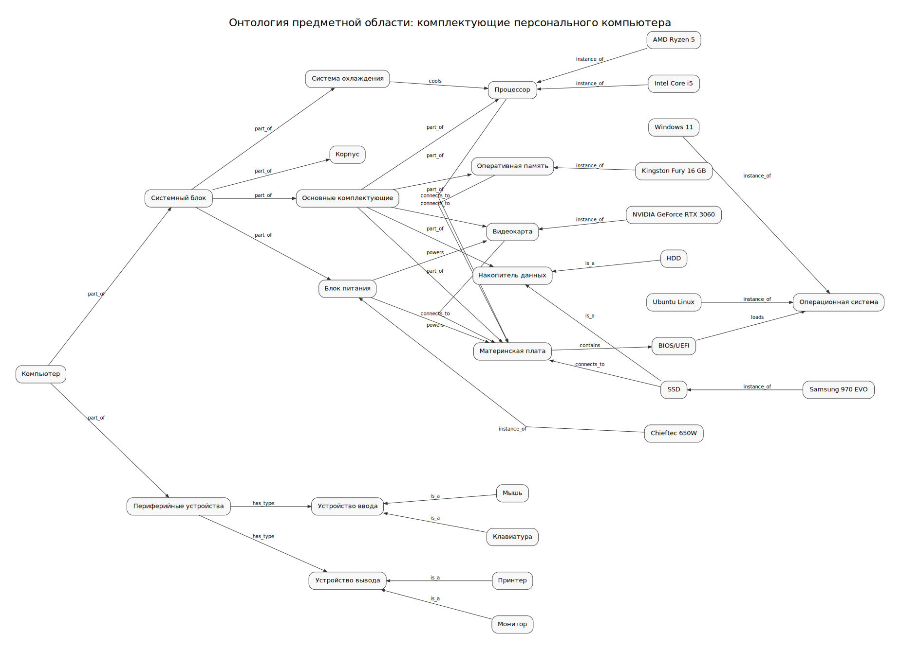

# Лабораторная работа №3. Представление знаний

## Тема

Онтология предметной области: **«Комплектующие персонального компьютера»**.

## Состав репозитория

- `lab03_pc_components_ontology_no_overlap.plantuml` — исходный файл PlantUML;
- `lab03_pc_components_ontology_no_overlap.svg` — готовая SVG-картинка графа;
- `lab03_pc_components_ontology_no_overlap.dot` — DOT-код графа, используемый внутри PlantUML.

## Соответствие требованиям лабораторной

В графе более 10 информационных единиц и более 2 типов связей.

Использованные типы связей:

- `is_a` — отношение классификации;
- `part_of` — отношение часть–целое;
- `instance_of` — отношение конкретного экземпляра к классу;
- `connects_to` — подключение компонента;
- `powers` — питание устройства;
- `cools` — охлаждение;
- `contains`, `loads`, `has_type` — дополнительные смысловые связи.

## Граф онтологии

